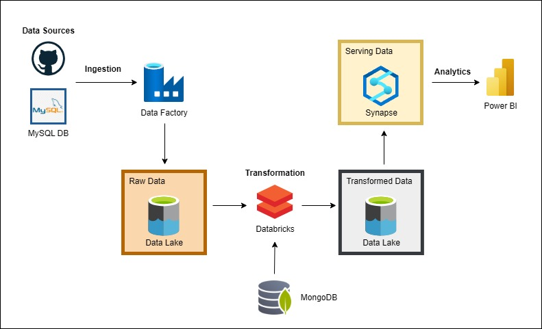

## Ecommerce-Data-Engineering

### 📌 Project Overview

This data engineering project is focused on processing and analyzing the Brazilian E-Commerce Public Dataset by Olist, which contains 100,000 orders made at Olist Store between 2016 and 2018. The project involves ingesting, transforming, and analyzing the data using multiple tools within the Azure ecosystem, including Azure Data Factory (ADF), Databricks, and Synapse Analytics. The goal is to transform raw data into usable business insights, serving the final data for visualization and reporting.

### 📊 Architecture & Workflow

### 🛠️ Tools & Technologies Used:
- **Azure Data Factory (ADF)**: For orchestrating data ingestion from various sources to the Azure Data Lake Storage (ADLS).
- **Databricks**: For performing data transformation on the ingested data.
- **Synapse Analytics**: For serving the transformed data to Power BI via SQL queries.
- **Power BI**: For creating dashboards and visualizations from the final dataset.
- **MySQL**: For managing one of the CSV datasets in a relational database.
- **MongoDB**: For replacing Brazilian product category names with English equivalents.

### 📑 Dataset Description

The dataset, provided by Olist, contains information about 100,000 orders from 2016 to 2018, made at various Brazilian marketplaces. It includes several features, such as:
- **Order Details**: Order status, price, payment, and delivery performance.
- **Customer Information**: Customer location and demographics.
- **Product Information**: Product details, category, and description.
- **Reviews**: Customer reviews, feedback, and ratings.

### 🚀 Engineering Process

1. **Data Sources**: 
   - **CSV Files**: The main dataset, including orders, products, customers, and reviews, was ingested from GitHub repository.
   - **MySQL**: CSV files was loaded into a MySQL database to manage the relational data.
   - **MongoDB**: A MongoDB instance was used to replace Brazilian product category names with English equivalents for easier analysis.

2. **Data Ingestion to Bronze Layer**: 
   - The raw data from the CSV files was ingested into the **Bronze Layer** in Azure Data Lake Storage (ADLS) using Azure Data Factory (ADF).

3. **Data Transformation in Databricks**:
   - Data was cleaned and transformed using Databricks notebooks. Key transformations included converting category names to English, removing nulls, and standardizing columns for consistency.

4. **Data Ingestion to Silver Layer**:
   - The transformed data was moved to the **Silver Layer** in ADLS for further processing.

5. **Gold Layer in Synapse Analytics**:
   - The final, cleaned, and transformed data was moved to the **Gold Layer** in Synapse Analytics, making it available for SQL queries.

6. **SQL Queries**:
   - SQL queries were written in Synapse Analytics to aggregate, filter, and prepare the data for reporting.

7. **Data Serving for Reporting**:
   - The cleaned and aggregated data was then served to Power BI for visualization and business analysis.
