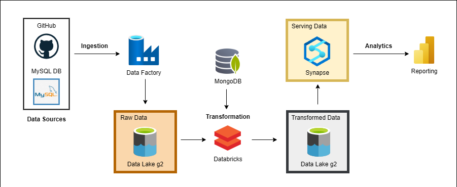

## E-Commerce-Data-Engineering

### 📌 Project Overview

This end-to-end data engineering project focuses on processing and analyzing the E-Commerce Public Dataset by Olist, which includes over 100,000 orders placed between 2016 and 2018. The project simulates a real-world analytics pipeline using the Azure data ecosystem, including Azure Data Lake Storage, Azure Data Factory, Databricks, and Synapse Analytics to transform raw transactional data into meaningful business insights. It also integrates Azure Key Vault to securely manage credentials. The final insights are delivered through an interactive Power BI dashboard, built on top of the curated gold layer.

---

### 🛠️ Tools & Technologies Used:

        

---

### 📊 Architecture & Workflow

---

### 📑 Dataset Description

The dataset, provided by Olist, contains information about 100,000 orders from 2016 to 2018, made at various Brazilian marketplaces. It includes several features, such as:
- **Order Details**: Order status, payment, and delivery performance.
- **Customer Information**: Customer location and demographics.
- **Product Information**: Product details, category, and description.
- **Reviews**: Customer reviews, and ratings.

---

### 🚀 Engineering Process

1. **Data Sources**: 
   - **CSV Files**: The main dataset, including orders, products, customers, and reviews, was ingested from GitHub repository.
   - **MySQL**: CSV file was loaded into a MySQL database to manage the relational data.
   - **MongoDB**: A MongoDB instance was used to replace Brazilian product category names with English equivalents for easier analysis.

2. **Data Ingestion to Bronze Layer**: 
   - The raw data from the CSV files was ingested into the **Bronze Layer** in Azure Data Lake Storage (ADLS) using Azure Data Factory (ADF).
   - **Data Sources**: GitHub, MySQL Database.

3. **Data Transformation in Databricks**:
   - Data was cleaned and transformed using Databricks notebooks.
   - Key transformations included converting category names to English by ingesting data from MongoDB, removing duplicates, and standardizing date columns for consistency.

4. **Data Ingestion to Silver Layer**:
   - The transformed data was moved to the **Silver Layer** in ADLS for further processing.

5. **Gold Layer in Synapse Analytics**:
   - The final, cleaned, and transformed data was moved to the **Gold Layer** with Synapse Analytics, making it available for serving.
   - SQL queries were written in Synapse Analytics to aggregate, filter, and prepare the data for reporting in Power BI.

---

### 🔎 Dashboard

---
